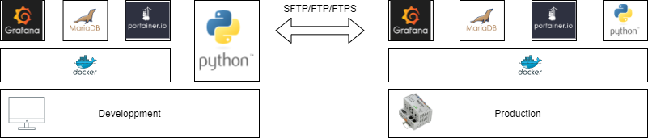
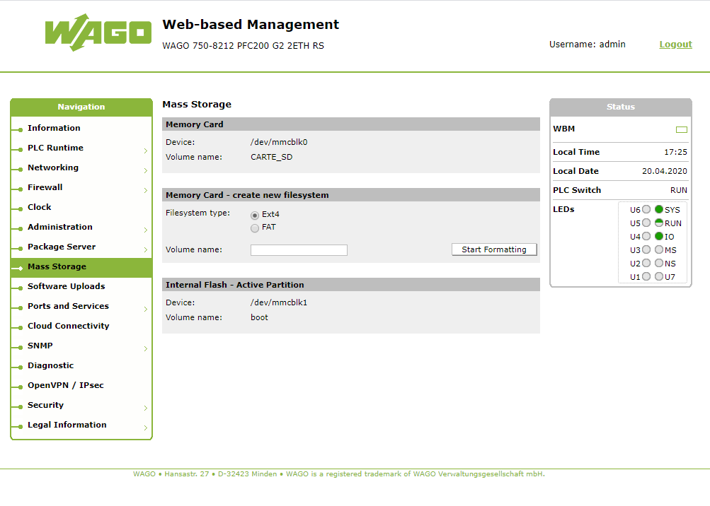

# GMND-Boilerplate
- [GMND-Boilerplate](#gmnd-boilerplate)
  - [Indroduction](#indroduction)
  - [Prerequisites](#prerequisites)
    - [On your developpement platform](#on-your-developpement-platform)
      - [Install on WAGO PFC200 or TouchPanel600](#install-on-wago-pfc200-or-touchpanel600)
    - [On your production platform](#on-your-production-platform)
  - [Run in developpment mode](#run-in-developpment-mode)
  - [Run in production mode](#run-in-production-mode)
    - [On WAGO PFC200 or TouchPanel600](#on-wago-pfc200-or-touchpanel600)
  - [Docker container data persistence](#docker-container-data-persistence)
    - [MariaDB](#mariadb)
    - [Grafana](#grafana)
    - [Portainer](#portainer)
    - [Python](#python)
  - [Python project](#python-project)
  - [Contributing](#contributing)
  - [Credits](#credits)
  - [Liscence](#liscence)


## Indroduction

GMND-Boilerplate is a template for working with Grafana, MariaDB and Python 3.5 on Docker. 

The objective of this repository is to facilitate development as well as deployment on ARMv7 platform (in my case I use it on the PFC200 and TouchPanel of the company [WAGO-Contact](https://www.wago.com/global/open-automation/modular-software)).



The [Portainer](https://www.portainer.io/) utility is also integrated into this project in order to facilitate the administration and monitoring of containers

## Prerequisites

Before using GMND-Boilerplate, you must install the following software.

### On your developpement platform

I start from the principle where you run your python script directly on the development machine to facilitate debugging and save time.

* Python >= 3.5
* Pip >=20.0.2
* Docker
* Docker-compose

#### Install on WAGO PFC200 or TouchPanel600

1. Install the docker ipk file [WAGO/docker-ipk](https://github.com/WAGO/docker-ipk)
2. Install the docker-compose ipk file [WAGO/docker-compose-ipk](https://github.com/WAGO/docker-compose-ipk)
3. Change the docker directory from the internal flash to the SD-Card
   1. Formate the SD or µSD card in Ext4 from the Web-Based Managment (WBM) 
   2. Start SSH Client e.g. [Putty](https://www.putty.org/)
      ```
      login as `root`
      password `wago`
      ```
   3. Edit the "/etc/docker/daemon.json" file
      ```
      nano  /etc/docker/daemon.json
      ```

      ```
      {
        "data-root":"/media/home/docker"
      }
      ```
       Replace "home" with the name given during the formatting step 
   4. Restart the PLC electrically
4. Place the GMND-Boilerplate directory at the root of the SD card (can do this with [fileZilla](https://filezilla-project.org/) for example in FTP / FTPS or SFTP)

### On your production platform

* Docker
* Docker-compose


## Run in developpment mode

Start the MariaDB, Portainer and Grafana instances conatainers.

```
docker-compose -f "docker-compose.yml" up -d --build
```

Start in dev mode your Python 3.5 application.

```
python main.py
```

## Run in production mode

Uncomment the folowing lines in the docker-compose.yml file.

```
#python-service:
  # python-service:
  #   build:
  #     context: .
  #     dockerfile: dockerfile-python
  #   volumes:
  #     - .:/usr/src/app
  #   restart: unless-stopped
  #   environment:
  #     - PYTHONPATH=/usr/lib/python3.8/site-packages
  #   command: python ./main.py
```

Start the MariaDB, Grafana, Portainer and Python 3.5 instances conatainers.

```
docker-compose -f "docker-compose.yml" up -d --build
```
### On WAGO PFC200 or TouchPanel600
  1. Start SSH Client e.g. [Putty](https://www.putty.org/)
      ```
      login as `root`
      password `wago`
      ```
  2. Go in the GMND-Boilerplate directory (at the root of the SD card)
      ```
      cd /media/sd/GMND-Boilerplate
      ```
  3. Start the MariaDB, Grafana, Portainer and Python 3.5 instances conatainers.
      ```
      docker-compose -f "docker-compose.yml" up -d --build
      ```

## Docker container data persistence

### MariaDB

A v_mariadb volume is created for the persistence of mariadb data

### Grafana

A v_grafana volume is created for the persistence of grafana data

### Portainer

A v_portainer volume is created for the persistence of portainer data

### Python

This project directory is mounted as a volume for the Python 3.5 container

## Python project

The entry point for the python project is the main.py file. This project integrates the ORM [SQLAlchemy](https://www.sqlalchemy.org/) and the client OPC-UA [FreeOpcUa/Python OPC-UA](https://github.com/FreeOpcUa/python-opcua).

In order to configure the connections you can rename the file 'template.config.yml' to 'config.yml' and enter the different connection parameters there.

## Contributing

1. Fork it!
2. Create your feature branch: git checkout -b my-new-feature
3. Commit your changes: git commit -am 'Add some feature'
4. Push to the branch: git push origin my-new-feature
5. Submit a pull request :D
## Credits

Lead Developer - Julien TALBOURDET (@Talbourdet)

## Liscence

The MIT License (MIT)