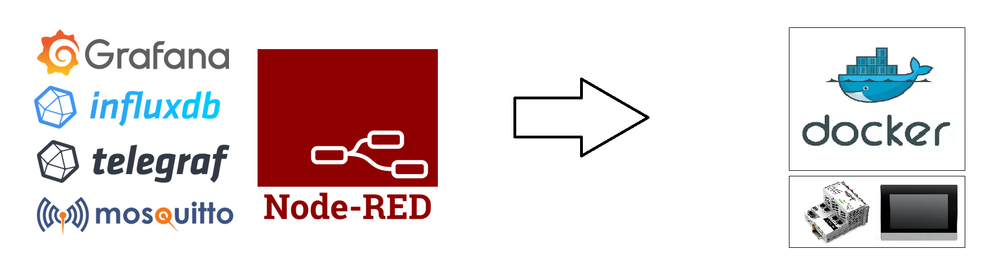

# EdgeDockerStack

## Indroduction

The objective of this project is to facilitate the deployment of Docker containers that I use regularly on WAGO-Contact brand controllers.

### List of used containers

- Mosqitto
- Telegraf
- Influxdb
- Grafana
- Node-red
- Portainer

## Prerequisite

Docker and Docker-compose must have been installed

### Wago Hardawares (PFC200 and TP600)

Follow the explanations of these two repositories in order to correctly install docker and docker-compose on your target wago

Readme [WAGO/docker-ipk](https://github.com/WAGO/docker-ipk)

Readme [WAGO/docker-compose-ipk](https://github.com/WAGO/docker-compose-ipk)

## Installation

Make sure you have your equipment connected to the network with internet access (do not forget to configure the DNS and the gateway address)

Connect to the equipment in SSH (use for example putty on windows) and go preferably in the sd card.

```
cd /media/sd
```

Download the installation script

```
wget -O install.sh https://raw.githubusercontent.com/Talbourdet/EdgeDockerStack/master/install.sh
```
Run the installation script
```
/bin/bash install.sh
```
Move into the EdgeDockerStack directory
```
cd EdgeDockerStack
```
Build and start the containers
```
docker-compose up -d --build
```

As soon as the installation is complete, the various services are accessible according to the following URLs

* Mosquitto-MQTT at [IP ADRESS]:1883
* Grafana at http://[IP ADRESS]:3000
* Portainer at http://[IP ADRESS]:9000
* Node-red at http://[IP ADRESS]:1880

## Detailed information

### Docker containers data persistence

All the persitents files are strored in the "containers-datas" directory who is created at the first startup. Each container has its own directory inside "container-datas".

### Configuring Docker containers

The version of the images used as well as the identifiers of the influxdb database can be defined in the .env configuration file


The identifier and the hash of the Node-red password can also be customized in the .env configuration file
The default username is "admin" and the hash corresponds to the password "password"
```
NODERED_ADMIN_USER=admin
NODERED_ADMIN_PASSWORD_HASH=$2b$08$3mbaVbd/FMiBhFPusYnWgOofr2OqVs4llwxWVf8MpHfeA5njd17ni
```

The configuration files of the other tools are in the "containers-confs/files" directory. You will find there the configuration files (grafan.ini, telegraf.conf, setting.json...).

## Contributing

1. Fork it!
2. Create your feature branch: git checkout -b my-new-feature
3. Commit your changes: git commit -am 'Add some feature'
4. Push to the branch: git push origin my-new-feature
5. Submit a pull request :D
## Credits

Lead Developer - Julien TALBOURDET (@Talbourdet)

## Liscence

The MIT License (MIT)